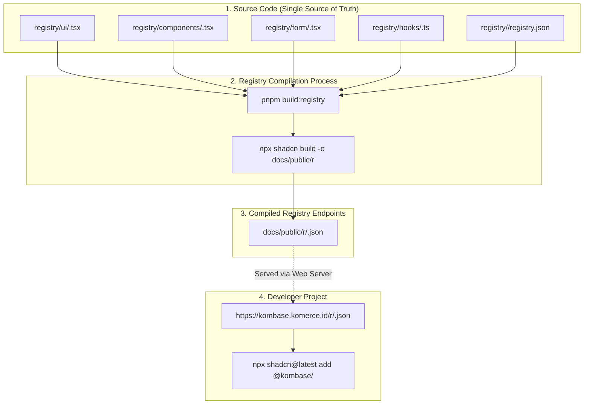

# Contributing to Kombase

Thank you for your interest in contributing to Kombase! To maintain high code quality, consistency, and automated release workflows, we follow a standardized contribution process.

---

## 🛠️ Prerequisites & Tools

Make sure you have the following installed on your environment before getting started:

- **Node.js**: `v18.0.0` or higher (`v20+` recommended)
- **Package Manager**: `pnpm` (v9+) — *Do not use `npm` or `yarn`*.
- **Code Quality**: [Biome](https://biomejs.dev/) (used for linting and formatting).
- **Versioning**: [Changesets](https://github.com/changesets/changesets).
- **Commit Standard**: [Conventional Commits](https://www.conventionalcommits.org/).

---

## 🚀 Getting Started & Local Development

### 1. Clone & Install

```bash
git clone https://github.com/fykom/kombase.git
cd kombase
pnpm install
```

### 2. Common Development Commands

| Command | Description |
| :--- | :--- |
| `pnpm dev:docs` | Starts the documentation site dev server (React Router v7 + Fumadocs) |
| `pnpm build:registry` | Compiles component source code in `registry/` into JSON endpoints under `docs/public/r/` |
| `pnpm build:docs` | Builds the full documentation site production bundle |
| `pnpm format` | Auto-formats all code using Biome |
| `pnpm format:check` | Checks code formatting without modifying files |
| `pnpm lint:check` | Runs Biome linter across the entire project |
| `pnpm validate` | Full validation pipeline (`pnpm format && pnpm lint:check && pnpm build:docs`) |
| `pnpm changeset` | Generates a changeset file to track semver version bumps |

---

## 📂 Project Architecture & Single Source of Truth

All component source code lives in the `registry/` directory, organized by category:

```text
kombase/
├── registry/               # 👈 SINGLE SOURCE OF TRUTH FOR ALL COMPONENTS
│   ├── ui/                 # Primitives (button, input, dialog, calendar, select, etc.)
│   ├── components/         # Complex components (data-table, tour, stepper, etc.)
│   ├── form/               # Form controls with react-hook-form integration
│   ├── hooks/              # Custom React hooks (use-media-query, etc.)
│   ├── lib/                # Shared utilities (utils.ts, format.ts, etc.)
│   └── tsconfig.json
├── docs/                   # Documentation website (React Router v7 + Fumadocs MDX)
│   ├── app/content/        # MDX documentation content pages
│   ├── app/examples/       # Interactive component demo examples
│   └── public/r/           # Compiled Shadcn JSON registry output endpoints
├── .changeset/             # Changeset version tracking
├── registry.json           # Root registry index listing sub-registries
├── package.json            # Root workspace scripts & shared devDependencies
└── pnpm-workspace.yaml     # Monorepo workspace configuration
```

### 🔄 Architecture & Data Flow Diagram



> ⚠️ **CRITICAL RULE**: Always write and edit component source code inside `registry/`. Do **NOT** edit files in `packages/src/` directly (which is maintained only for legacy backward compatibility).

---

## 📋 Step-by-Step Guide for Adding or Modifying Components

Follow these steps sequentially whenever you add a new component, hook, utility, or feature:

### Step 1: Create Component Source Code (`registry/`)

Select the appropriate category folder under `registry/`:
- UI Primitive: `registry/ui/<component-name>.tsx`
- Complex Component: `registry/components/<component-name>.tsx` (or directory if multi-file)
- Form Field Wrapper: `registry/form/<form-component-name>.tsx`
- Custom Hook: `registry/hooks/<hook-name>.ts`
- Utility: `registry/lib/<utility-name>.ts`

**Code Guidelines:**
- Use `kebab-case` for filenames.
- Always use the `cn()` helper from `@/lib/utils` (or `@kombase/utils`) for Tailwind CSS class merging.
- Define proper TypeScript interfaces/types for component props.

### Step 2: Register in Category Manifest (`registry/<category>/registry.json`)

Every component must be registered in its category manifest (e.g. `registry/ui/registry.json`, `registry/components/registry.json`, `registry/form/registry.json`).

Add a new item entry matching the Shadcn registry schema:

```json
{
  "name": "my-component",
  "type": "registry:ui",
  "title": "My Component",
  "description": "A brief description of what this component does.",
  "dependencies": ["@radix-ui/react-dialog"],
  "registryDependencies": ["button", "@kombase/utils"],
  "files": [
    {
      "path": "my-component.tsx",
      "target": "@ui/my-component.tsx",
      "type": "registry:ui"
    }
  ]
}
```

- `name`: Kebab-case identifier used in `npx shadcn@latest add @kombase/<name>`.
- `dependencies`: Array of external npm packages required.
- `registryDependencies`: Array of internal kombase or shadcn components required as prerequisites.
- `files.path`: File path relative to the category directory.
- `files.target`: Target import path alias in user projects (e.g., `@ui/my-component.tsx`, `@components/my-component.tsx`, `@form/my-component.tsx`).

### Step 3: Verify Registry Build

Compile the registry output to ensure the CLI schema is valid and output files are generated:

```bash
pnpm build:registry
```

Verify that `docs/public/r/my-component.json` is generated without any CLI errors.

### Step 4: Create Interactive Demo Example (`docs/app/examples/`)

Create an interactive demo file at `docs/app/examples/my-component-demo.tsx`:

```tsx
import { MyComponent } from '@/registry/ui/my-component';

export default function MyComponentDemo() {
  return (
    <div className="flex items-center justify-center p-4">
      <MyComponent />
    </div>
  );
}
```

### Step 5: Add Documentation Page MDX (`docs/app/content/`)

Create an MDX documentation page in `docs/app/content/components/my-component.mdx` (or `docs/app/content/form/` for form components):

```mdx
---
title: My Component
description: A short description of the component functionality.
---

## Preview

<ComponentPreview name="my-component-demo" />

## Installation

```bash
npx shadcn@latest add @kombase/my-component
```

## Usage

```tsx
import { MyComponent } from "@/components/ui/my-component";

export function Example() {
  return <MyComponent />;
}
```
```

### Step 6: Validate Code Quality & Build

Run the full validation suite to verify code formatting, Biome linting, and documentation build:

```bash
pnpm validate
```

Fix any linter warnings or TypeScript errors before proceeding.

### Step 7: Create a Changeset

Before submitting a Pull Request, you **must** create a changeset if your changes alter the public API, add new features, or fix bugs:

```bash
pnpm changeset
```

1. Select the package(s) affected (e.g. `kombase-workspace` / `docs`).
2. Choose the semver bump type:
   - `minor`: New feature / component addition (`feat`)
   - `patch`: Bug fix or documentation fix (`fix` / `docs`)
3. Write a clear summary of your changes.

A new `.md` file will be created under `.changeset/`. Commit this file along with your PR.

### Step 8: Commit using Conventional Commits

We enforce Conventional Commits. Commit messages must follow this structure:

```text
<type>[optional scope]: <description>
```

**Examples:**
- `feat(ui): add my-component primitive`
- `feat(form): add form-password wrapper`
- `fix(components): fix accessibility issue in confirm-dialog`
- `docs: add manual installation steps to index page`

---

## 📜 Pull Request Checklist

Before opening a PR, ensure:
- [ ] Code is located in `registry/` (not `packages/src/`).
- [ ] Registered in `registry/<category>/registry.json`.
- [ ] `pnpm build:registry` runs without errors.
- [ ] Demo example created in `docs/app/examples/`.
- [ ] Documentation page created in `docs/app/content/`.
- [ ] `pnpm validate` passes cleanly.
- [ ] Created a changeset via `pnpm changeset`.
- [ ] Commit messages follow Conventional Commits.
